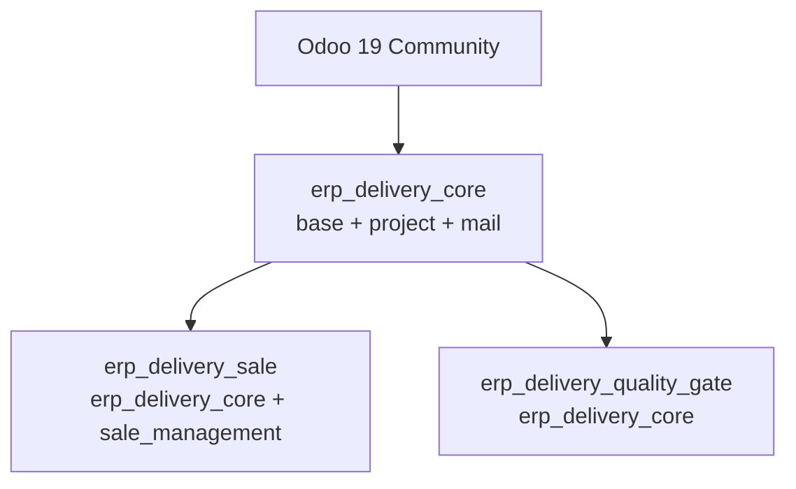

# ERP Platform Delivery Management

Odoo 19 Community addons for ERP implementation delivery projects.

## Architecture

The addons have explicit ownership boundaries: Core owns delivery data and workflow; Sales and Quality Gate are optional integrations. Neither optional addon depends on the other.



`erp_delivery_core` is the application entry point. It adds the ERP Delivery menu under the native project experience and owns customer metadata, project/task delivery fields, the solution catalog, access policy, performance aggregates, and Go-Live preconditions. `erp_delivery_sale` maps confirmed orders to delivery projects and solution modules. `erp_delivery_quality_gate` adds a project score and minimum threshold before Go-Live. Both integrations extend Core through Odoo's cooperative model inheritance and can be installed independently.

## Addons

- `erp_delivery_core`: customer metadata, project/task delivery fields, ERP solution catalog, access rules, and Go-live validation.
- `erp_delivery_sale`: creates a delivery project and solution-module rows from a confirmed sales order. Depends on Core, not Quality Gate.
- `erp_delivery_quality_gate`: optional project score/threshold check. Depends on Core, not Sales.

## Technical Decisions

- **Reuse native business records.** ERP customer attributes extend `res.partner`; delivery data extends `project.project` and `project.task`. This preserves native assignment, company, chatter, stage, task, and reporting behavior rather than creating parallel customer/project lifecycles.
- **Keep integrations optional.** Sales and Quality Gate are sibling addons that depend on Core only. Each adds its own `_validate_golive_conditions()` checks and calls `super()` so installed validations compose through the Python MRO without a bridge addon or a Sales-to-Quality dependency.
- **Enforce security at every layer.** ACLs provide model operations, record rules scope project/task/module records to allowed companies and assigned Consultant projects, and field `groups` restrict sensitive values such as internal cost and subscription value. Server-side guards restrict Consultant writes and prevent bypassing Go-Live checks; menus and readonly fields are not treated as security boundaries. ACL grants are additive, so the ERP role checks also protect users who belong to unrelated Odoo groups.
- **Isolate company data explicitly.** Project modules inherit their project's company. Solutions can be company-specific or shared when `company_id` is empty. Domains use each user's `company_ids`; partner ERP customer codes are unique per company.
- **Use cooperative Go-Live validation.** The stable `action_golive()` delegates to `_validate_golive_conditions()`. Core checks customer, manager, module, mandatory-task, and critical-risk requirements. Optional addons add checks before the action writes the final state/date.
- **Choose persisted metrics for operational reads.** Project counts, effort, task progress, and health are stored so project lists avoid per-row aggregation. This speeds reads but adds recompute/write work; `_read_group` batches source aggregation, and a daily job refreshes date-sensitive health in batches.
- **Respect Odoo 19 property-field constraints.** Company-dependent `internal_cost` uses a `Float`, because Odoo 19 does not support a company-dependent `Monetary` property field. Interpret it in the active company's currency and convert explicitly before comparing it with monetary amounts.
- **Convert Sales amounts at the project boundary.** Order totals and line subtotals are converted to the target company's currency using the order date before they are stored on the project/module. A unique sale-order link and duplicate check prevent creating multiple delivery projects from the same order.
- **Index for actual lookup patterns.** Customer/project codes, delivery state/date, health, task risk/acceptance, and relation keys support common search, grouping, and joins. Indexes add write/storage cost, so additional low-cardinality or composite indexes should follow query-plan evidence.

## Install

Add the Odoo 19 and custom addon paths, then install the desired modules:

```bash
./odoo19/odoo-bin \
  --addons-path=odoo19/addons,custom_addons \
  -d erp_delivery_dev \
  -i erp_delivery_core,erp_delivery_sale,erp_delivery_quality_gate
```

The Sales and Quality Gate addons can also be installed separately with Core. The ERP Delivery app opens the project list; open a project to use its ERP Delivery and optional Quality Gate tabs.

## Performance Design

1. Project module totals, mandatory-task progress, health risks, and sales-order project counts use `_read_group` over whole recordsets. This avoids one query per project. Aggregates are stored for fast list reads, at the cost of recomputation when source rows change.
2. Project creation uses `@api.model_create_multi`, and the batch performance test creates 50 projects and 500 tasks together. Batch calls reduce ORM overhead, while large batches still need bounded sizes to control transaction memory and lock duration.
3. Search-oriented fields such as project code, delivery state, expected Go-live date, customer code, risk, health, and acceptance have indexes. Indexes improve selective filtering but add write/storage cost; verify low-cardinality filters against representative query plans before adding more.
4. Stored health status is refreshed daily in batches of 500 because overdue status can change when the date advances without a project write. The batch approach bounds memory, while status may be stale until the scheduled job runs.

## Tests

Run the Core and Sales suites:

```bash
./odoo19/odoo-bin \
  --addons-path=odoo19/addons,custom_addons \
  -d erp_delivery_test \
  -i erp_delivery_core,erp_delivery_sale \
  --test-enable \
  --test-tags=/erp_delivery_core,/erp_delivery_sale \
  --stop-after-init
```

Add `erp_delivery_quality_gate` to `-i` and `--test-tags` to run the combined integration suite.