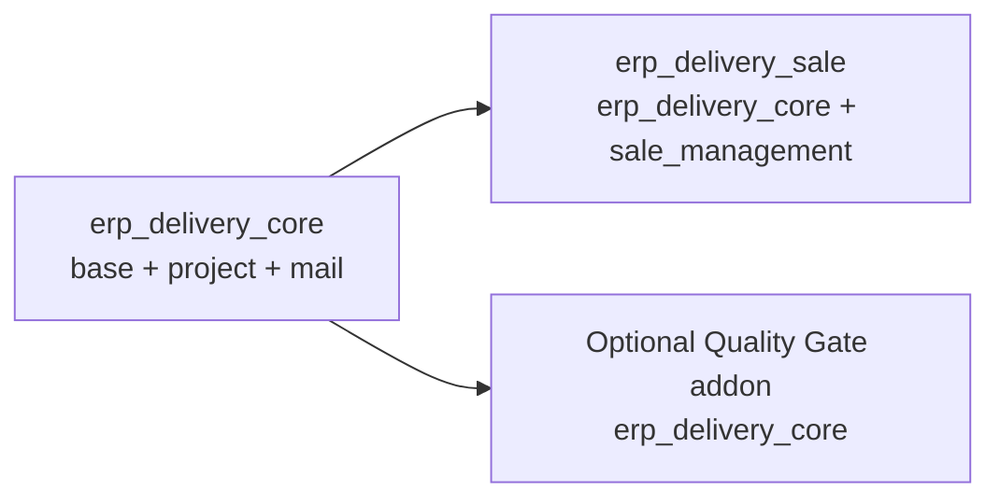

# Ghi chú kỹ thuật: ERP Platform Delivery Management

## 1. Kiến trúc addon và sơ đồ phụ thuộc

`erp_delivery_core` chịu trách nhiệm cho toàn bộ domain ERP: metadata khách hàng, trường triển khai trên project/task, catalog giải pháp, module ERP, bảo mật, sequence và kiểm tra Go-live. Addon này chỉ phụ thuộc vào `base`, `project` và `mail`. `erp_delivery_sale` là adapter tùy chọn: nó ánh xạ các dòng đơn hàng bán ra sang giải pháp và tạo các dự án triển khai liên kết; addon này phụ thuộc vào `erp_delivery_core` và `sale_management`.



`erp_delivery_quality_gate` là addon tùy chọn thứ ba, chỉ phụ thuộc vào Core. Addon này lưu điểm/ngưỡng chất lượng và mở rộng Go-live validation; nó có thể được cài độc lập với Sales.

## 2. Lựa chọn kế thừa model

- `res.partner` là bản ghi khách hàng/liên hệ chuẩn; cấp độ ERP, mã khách hàng, ngày hết hạn hợp đồng và giá trị đăng ký thuộc về khách hàng thay vì một model khách hàng riêng biệt song song.
- `project.project` vẫn là đơn vị tổng hợp triển khai và tái sử dụng các hành vi của Odoo về project, company, customer, manager và currency.
- `project.task` tái sử dụng vòng đời native của work item, phân công, stages và trạng thái đóng để theo dõi công việc bắt buộc trước Go-live và rủi ro.

Cách này mở rộng workflow chuẩn thay vì sao chép hoặc tạo các bản ghi cạnh tranh.

## 3. Trường lưu trữ và không lưu trữ

**Lưu trữ / computed stored:** mã dự án, trạng thái giao hàng, ngày Go-live kỳ vọng/thực tế, giá trị hợp đồng, mã khách hàng liên quan đã lưu, `duration_days`, tổng số module/nỗ lực, số task bắt buộc, tỷ lệ tiến độ và trạng thái sức khỏe đã index. Các trường quan hệ và scalar thông thường được lưu bình thường. Những giá trị này được đọc thường xuyên trong list project và báo cáo nên lưu trữ tổng hợp giúp tránh phải tính lại ở mỗi hàng.

**Computed không lưu trữ:** `sale.order.erp_project_id`, `erp_project_count`, và các trường tiền tệ phụ trợ như `erp_currency_id` và `erp.solution.currency_id`. Đây là lookup quan hệ/ngữ cảnh rẻ tiền và không cần giá trị persisted độc lập. One2many/Many2many là quan hệ, không phải cột scalar computed.

Tổng hợp lưu trữ đổi chỗ đọc nhanh hơn cho chi phí recompute/write. `health_status` cũng phụ thuộc vào thời gian nên được làm mới hàng ngày bởi cron theo các batch 500 project, tránh tải toàn bộ tập dữ liệu vào memory.

## 4. Hành vi hai chiều của duration/date

`duration_days` tính khoảng cách ngày giữa `date_start` và `go_live_expected_date`. Hàm inverse sẽ đặt `go_live_expected_date` = `date_start + duration_days`; nếu không có start date thì dùng ngày hiện tại. Vì vậy, chỉnh ngày sẽ tính lại duration, còn chỉnh duration sẽ cập nhật ngày. Giữ dependency và inverse đối xứng để tránh hai nguồn sự thật cạnh tranh.

## 5. Ba lớp bảo mật

1. **Menu/view visibility:** thuộc tính group quyết định navigation và control UI nào xuất hiện. Đây là vấn đề sử dụng, không phải ranh giới xác thực.
2. **Model access:** `ir.model.access.csv` cấp CRUD cho từng model và group. ACL không thể biểu diễn quyền sở hữu record.
3. **Record và field security:** `ir.rule` giới hạn record theo company và assignment; field `groups` (ví dụ: subscription value/internal cost) hạn chế trường nhạy cảm dù record đó có thể đọc được.

Luôn thực thi quyền trong ACL/rules và field groups; chỉ ẩn menu hoặc nút là không đủ.

## 6. Thành phần quyền Odoo

ACL là cộng dồn: quyền model hiệu dụng của user là hợp của tất cả grants từ các group của họ, bao gồm implied groups. Quy tắc record khác: global rules được AND; group rules áp dụng được OR với nhau, sau đó AND với global rules. Sự khác biệt này quan trọng đối với hạn chế project của Consultant: nó được mô tả như conditional global rule để giao nhau với quy tắc visibility mặc định của Project. Rule của Manager mở rộng visibility project chỉ trong các company được phép. Hạn chế field-level vẫn độc lập với cả ACL và record rules.

## 7. Chiến lược đa công ty

Project sử dụng `company_id` gốc; project modules kế thừa company của project và các solution có thể theo company hoặc chia sẻ khi `company_id` rỗng. Rules hạn chế các record thuộc company về `company_ids` đồng thời cho phép shared records khi được thiết kế. Mã khách hàng trong partner là unique theo `(company_id, erp_customer_code)`.

Chi phí nội bộ phụ thuộc công ty là `Float` vì Odoo 19 không hỗ trợ `Monetary` cho property field; giá trị này được hiểu theo currency của công ty đang active. Dùng company-aware currency field hoặc conversion rõ ràng ở nơi giá trị này được hiển thị hoặc so sánh với số tiền. Không dựa vào active company riêng khi xử lý records từ nhiều công ty; hãy dùng company và currency của từng record.

## 8. Cooperative Go-live hook

`action_golive()`ủy thác các điều kiện tiền đề cho `_validate_golive_conditions()`. Các extension thêm kiểm tra bằng cách override hook đó và gọi `super()` trước:

```python
def _validate_golive_conditions(self):
    super()._validate_golive_conditions()
    # Validate this addon's additional Go-live conditions.
```

Mỗi addon chỉ sở hữu quy tắc riêng; action vẫn ổn định và tất cả validation được cài đặt hợp lại thông qua Python MRO. Một validation mới phải fail trước khi ghi state/date.

## 9. Tích hợp Sales và Quality tùy chọn

Trong giới hạn ba addon, dùng Core, Sales và Quality như các module riêng biệt. Cả hai addon tùy chọn đều phụ thuộc vào Core, không phụ thuộc lẫn nhau. Sales chỉ tạo project từ confirmed orders và giữ mapping thương mại; Quality chịu trách nhiệm các field score và threshold. Nếu Go-live cần kiểm tra nào đó, mỗi addon đều mở rộng `_validate_golive_conditions()` theo kiểu cộng tác. Không cần addon bridge thứ tư hay dependency cứng giữa Sales và Quality.

Workspace triển khai Core, Sales và Quality Gate. Quality Gate dùng điểm 0-100, ngưỡng mặc định 80 có thể cấu hình bởi Manager; điểm dưới ngưỡng hoặc chưa có gate sẽ chặn Go-live. Sales validation và Quality validation phối hợp qua Python MRO và không phụ thuộc cứng lẫn nhau.

## 10. Kiểm soát N+1 query

- **Module totals:** gom `project.erp.module` một lần theo `project_id` và tổng hợp count/effort bằng `_read_group`; không tìm module trong vòng lặp project.
- **Task progress và risk:** gom mandatory tasks theo project/state và open risks theo project/risk; tránh `project.tasks.filtered(...)` hoặc `search_count()` một lần cho mỗi project.
- **Sales-order project count:** gom các linked projects cho toàn bộ recordset order bằng `_read_group`; tránh query count từng order. Chỉ lặp trong Python trên kết quả aggregate đã prefetch và gán giá trị.

`test_performance_batch.py` chạy 50 project và 500 task và xác minh số lượng SQL query bị giới hạn, thay vì phụ thuộc vào thời gian chạy máy cụ thể.

## 11. Chiến lược index

Dùng B-tree index cho equality/domain lookup có tính chọn lọc: mã ngoại vi/mã khách hàng, khóa ngoại project/module/task, và các trường hay lọc trong operational list. Các lựa chọn có index như `risk_level` có thể hỗ trợ truy vấn rủi ro mục tiêu, nhưng trường low-cardinality không tự động nhanh hơn khi index; cần validate trên domain thực tế và `EXPLAIN`. Unique constraint tạo index hỗ trợ riêng, nên tránh index dư thừa. Chỉ thêm composite/partial index sau khi phát hiện bottleneck query có số liệu rõ ràng.

## 12. Chiến lược cài đặt và test

Cài đặt `erp_delivery_core` riêng để validate domain, security, sequence và workflow Go-live. Cài đặt `erp_delivery_sale` cùng Core để validate dependency, inherited views, mapping SO-to-project/module và navigation. Chạy tests trên database disposable với Odoo `--test-enable` và module-scoped `--test-tags`; `TransactionCase` cô lập dữ liệu test thông qua transaction rollback. Giữ tests của addon tùy chọn trong package test của addon đó và thêm combined-install test khi addon và API của nó đã tồn tại.

Các suite TransactionCase của Core, Sales và Quality Gate được chạy trên Odoo 19 theo ba cấu hình: Core+Sales, Core+Quality Gate, và cả ba addon cùng cài.
